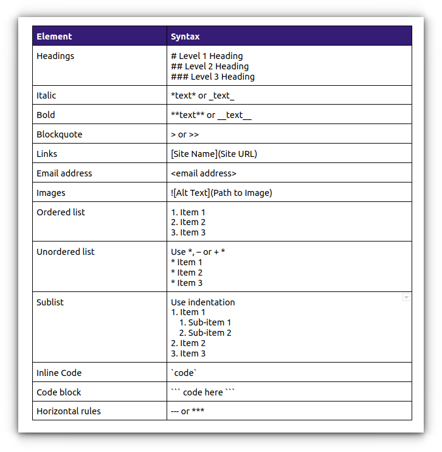

# **[Title of Project]**

**Course:** Ecological Genomics - Fall 2026

**Name**: [Your Name Here]

------------------------------------------------------------------------

## **[DATE] - Today's Task in a few words**

-   brief description of todays goals / what was done today

-   .......

-   ......

### Working Directory:

-   `ecological_genomics/projects/[......]`

### Input Files:

-   `[Input filePaths]`

### Output files:

-   `[Output filePaths]`

### Scripts:

-   `ecological_genomics/projects/scripts/[scriptNameHere]`

### Programs/Dependencies:

-   `R version 4.6.1`
-   `R-Studeo`

### Important Code / Parameters Run:

``` r
print("Hello World")
```

### Graphs/Images:

-   Markdown Help Sheet:

    {width="671"}

### Tables:

| Col1 | Col2 | Col3 |
|------|------|------|
| xxx  | xxx  | xxx  |
| xxx  | xxx  | xxx  |
| xxx  | xxx  | xxx  |

### Notes / Observations:

-   Take note of observations form your data as you work with it. for example,
