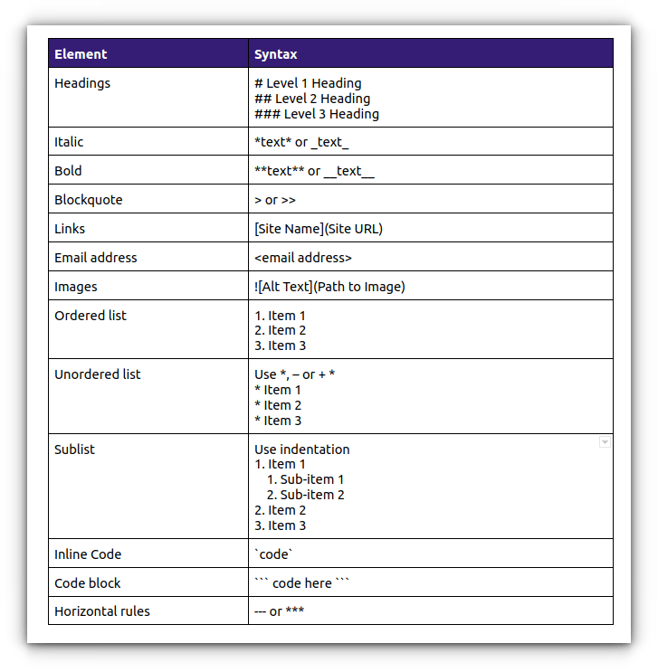

# **[Title of Project]**

**Course:** Ecological Genomics - Fall 2026

**Name**: [Your Name Here]

------------------------------------------------------------------------

## **[DATE] - Today's Task in a few words**

-   [brief description of today's goals / what was done today]

### Working Directory:

-   `/gpfs1/home/a/r/armccrac/eco_genomics_2026/[......]`

### Input Files:

-   `[Input filePaths]`

### Output files:

-   `[Output filePaths]`

### Scripts:

-   `ecological_genomics/projects/transcriptomics/scripts/[scriptNameHere]`

### Programs/Dependencies:

-   `R version 4.6.1`

-   `R-Studeo`

### Important Code / Parameters Run:

``` r
library()


```

### Graphs/Images:



### Tables:

| Col1 | Col2 | Col3 |
|------|------|------|
|      |      |      |
|      |      |      |
|      |      |      |

### Notes / Observations:

-   Take note of observations form your data as you work with it. for example,
